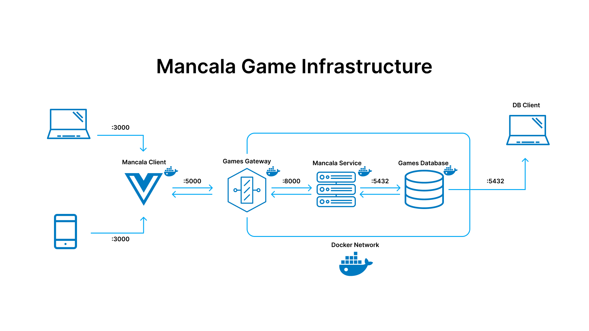
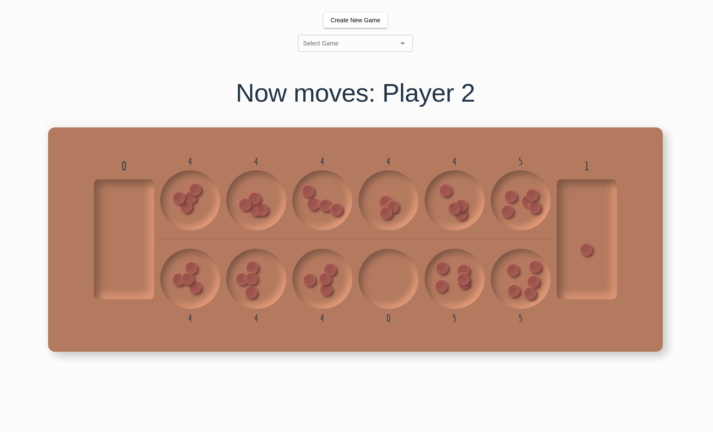

## International Space Station app

This project is a persistent mancala game. It consists of a client application, an api gateway, an api service and a database.

You are able to create a new game, and play it. The game is persistent, so you can come back to it later, or if you are up to the challenge, play more than one game at the same time.

- [Application Structure](#application-structure)
- [Application Dataflow](#application-dataflow)
- [Running app locally](#running-app-locally)
- [Api Documentation](#api-documentation)
- [Application testing](#application-testing)
- [Application usage](#application-usage)
- [Author message](#author-message)

### Application Structure

This application is structured by:

- **Client (Vue)** _An application the end user can interact with_
- **Api Gateway (Go)** _An entry point to the services_
- **Mancala Service (Go)** _A web server to be consumed by client application_
- **PostgreSQL Database** _Database to store ISS location_

For local development all the applications run in docker containers and it is orchestrated via docker-compose

### Application Dataflow

<p align="center">
  
</p>

- Mancala client accessible on port 3000 locally.
- Api gateway accessible on port 5000 locally. (This is the only port that should be exposed to the internet)
- Api service accessible on port 8000 on docker network only.
- Database accessible on port 5432 on docker network, and locally for development purposes.

### Running app locally

> To be able to run the application you need docker and docker-compose installed. Please refer to the [docs](https://docs.docker.com/compose/install/) to install them before taking any further steps
> Clone this repository

```bash
git clone https://github.com/Abeldlp/bol-assingment.git
```

Go to the directory

```bash
cd bol-assingment
```

Build docker images (cup of coffee)

```bash
docker-compose build
```

Run all containers in detached mode

```bash
docker-compose up -d
```

At this point you will have four containers running and you can access the client on [http://localhost:3000](http://localhost:3000)

<p align="center">
  
</p>
If you want to access the database container use a client of your liking, and connect to postgres with the following.

- USERNAME `user`
- PASSWORD `password`
- HOST `localhost`
- PORT `5432`
- DATABASE `app-db`

If you want to play with the api, the api gateway is listening on [http://localhost:5000](http://localhost:5000)

To stop the containers you can run the following

```bash
docker-compose down
```

> Optionaly if you have `make` and `build-essentials` installed locally you can make use of the `Makefile`

### Api Documentation

The api documentation is available on [http://localhost:5000/v1/api/docs/index.html](http://localhost:5000/v1/api/docs/index.html)

The api documentation is generated using [swag](https://github.com/swaggo/swag). To generate the documentation you can run the following command
>Note: to generate the documentation you need swag installed locally. Refer to the [docs](https://github.com/swaggo/swag#getting-started) to install it.

```bash
make docs
```

This will generate the documentation and update the `docs` folder.
The docs folder is served by mancala api through the api gateway.

### Application testing

To run all tests at once you can make use of the Makefile. You will need `make` and `build-essentials` installed locally. Refer to your OS/Distro installation docs.

```bash
make test
```

The above command will run mancala api-service tests and api-gateway tests.

> Note: to run tests you need go installed locally

To run them individually you can run the following:

**Api Service**

```bash
cd mancala-api && go test ./test/...
```

**Api Gateway**

```bash
cd api-gateway && go test ./test/...
```

### Application usage

The client application consists on:

- Create mancala game
- Select mancala game
- Game board

**Create mancala game**

Creates a new mancala game record in the database, along with two players connected to that game.

**Select mancala game**

Shows a dropdown with the available games. You can select any game available and it will be loaded in the board below

**Game board**

Mancala board. Enjoy the game.

### Author message

This application is simple to use and straight to the point. If you wish to develop locally remember that you will need Golang and Node installed.

If any questions come your way don't hesitate to drop an email to <abel45991690@gmail.com>

<p align="center">
  
</p>
